# 🛡️ Enterprise Disaster Recovery & System Migration (RHEL 10)

## 📌 The Big Why
In enterprise data centers, hardware failures and data corruption are inevitable. Operating without a solid disaster recovery (DR) and provisioning strategy can lead to catastrophic downtime. This project focuses on building an immutable infrastructure pipeline by generating custom "Gold Images" using Red Hat's **Image Builder** (`osbuild`). Additionally, it demonstrates enterprise-grade backup strategies for critical configuration files (`/etc`) and bare-metal restoration techniques to ensure business continuity and rapid recovery (low RTO).

## 🏗️ Logical Architecture Flow
Below is the logical flow of the Disaster Recovery and Provisioning pipeline. The Build Server acts as the core engine, processing a declarative `.toml` blueprint to bake a complete RHEL 10 operating system into a dynamic `qcow2` virtual disk. Concurrently, a backup and quarantine methodology is established to safely archive and restore mission-critical system configurations without risking active kernel panics.

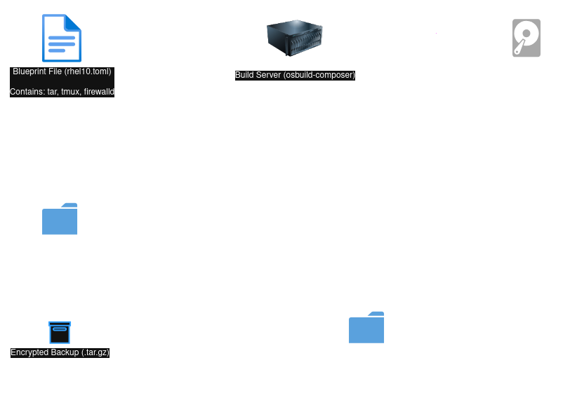

## 🛠️ Core Commands Used
*   `sudo systemctl enable --now osbuild-composer.socket` - To initialize and activate the Image Builder backend engine on-demand.
*   `composer-cli blueprints push / depsolve` - To upload the declarative infrastructure configuration and validate package dependencies prior to the build phase.
*   `composer-cli compose start <blueprint> qcow2` - To trigger the automated baking process of the custom OS image into a KVM-ready virtual disk.
*   `sudo tar -czvf / -xzvf` - To securely archive, compress, and safely extract critical system configurations (`/etc`) to and from a designated staging quarantine area.

## 📸 Verification & Proof of Concept

### 1. Image Builder Setup & Blueprint Validation
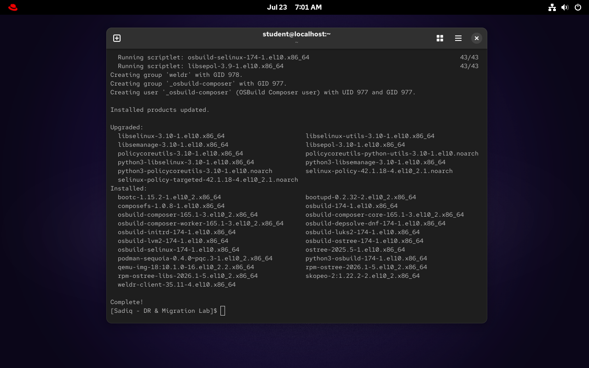
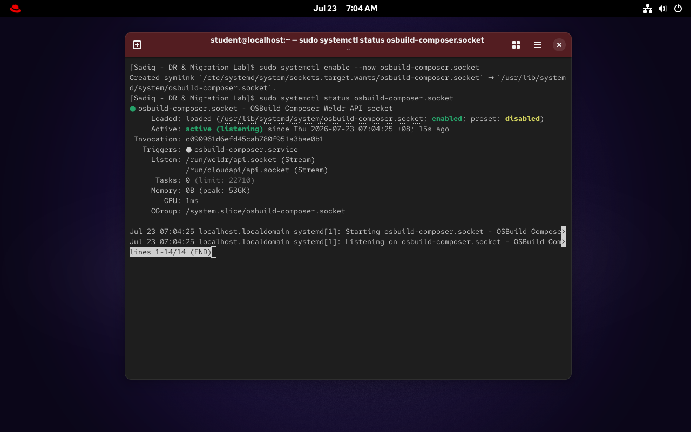
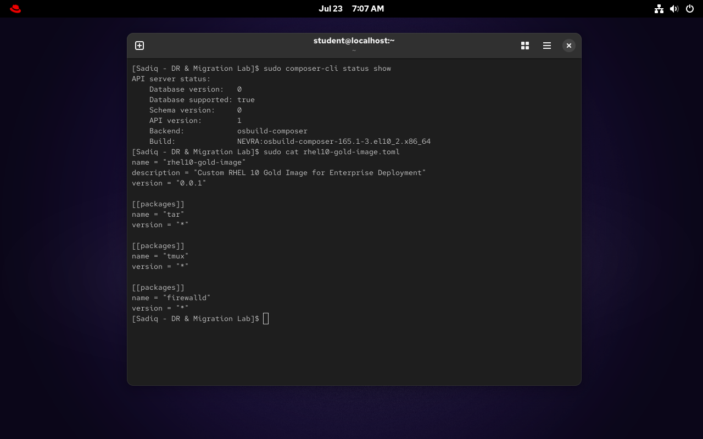
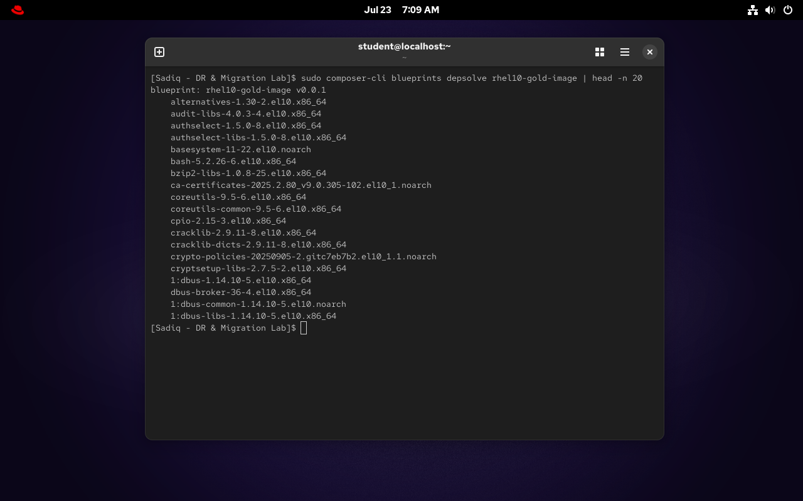

### 2. Gold Image Baking Process
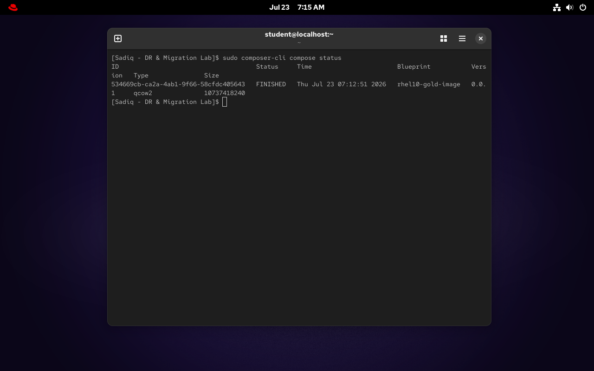

### 3. Enterprise Configuration Backup & Disaster Simulation
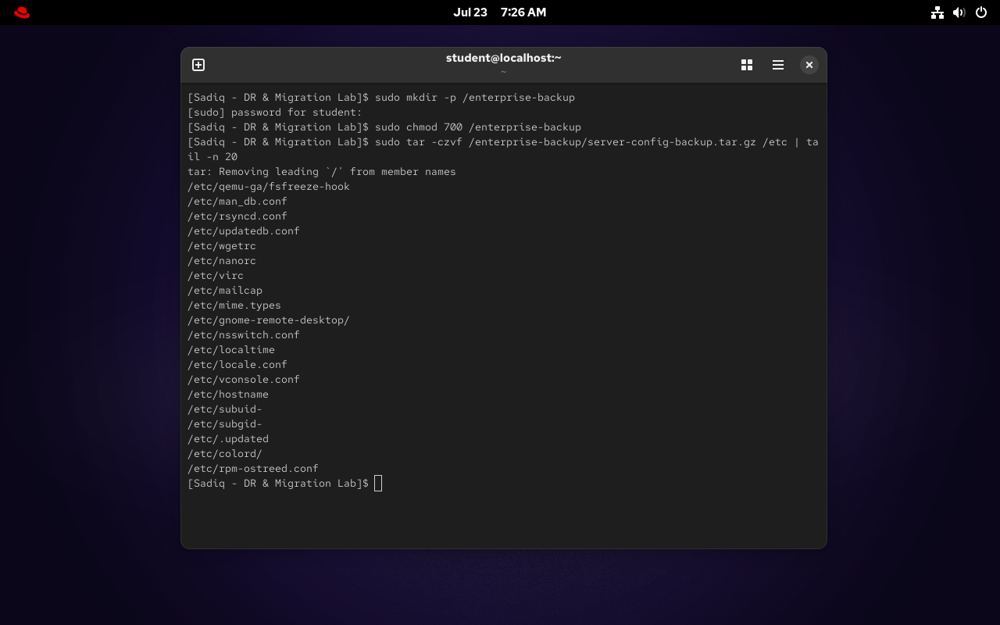
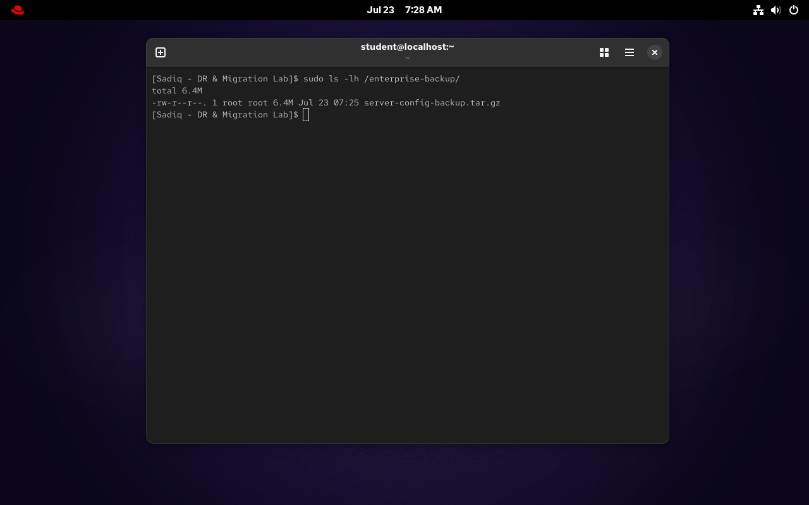
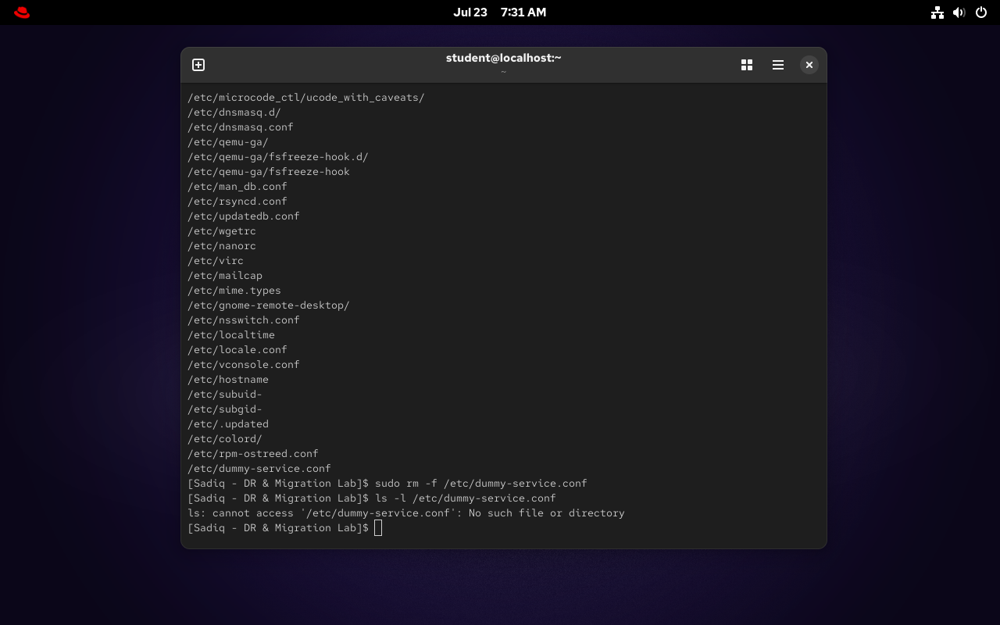
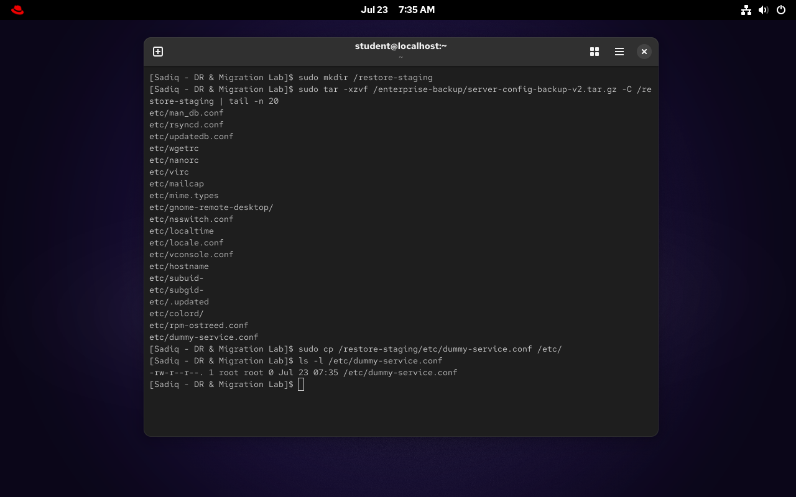

### 4. Image Extraction & Deployment Readiness
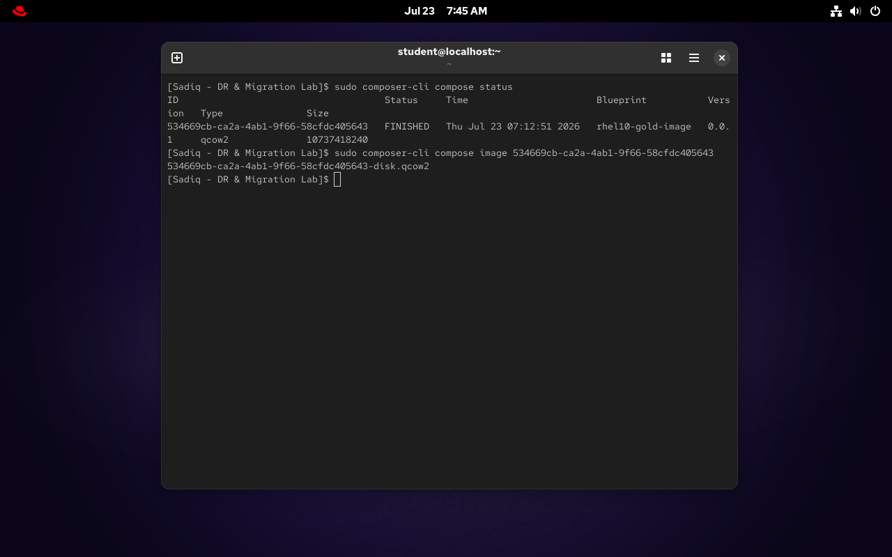
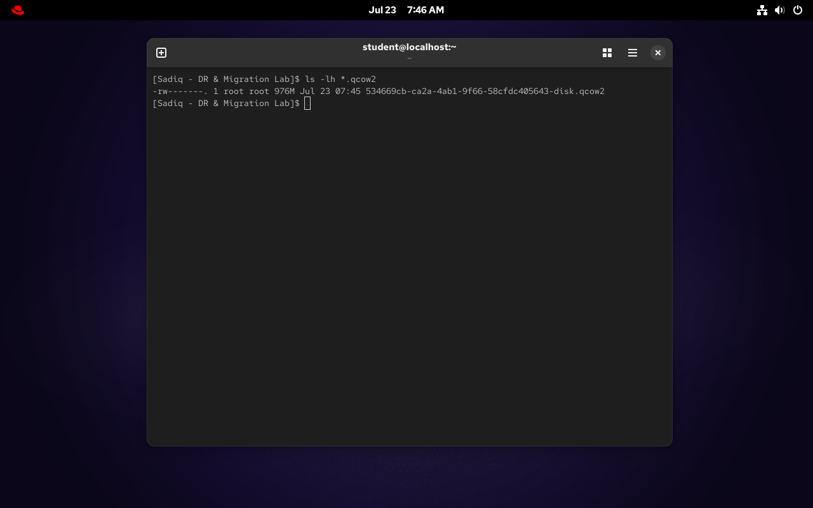

## ⚠️ Troubleshooting Risk & Lessons Learned
**1. Storage Exhaustion During Image Composition:** 
During the `osbuild` composition phase, the process initially failed due to insufficient disk space on the root partition. The Image Builder requires substantial storage (15GB–20GB+) to temporarily extract dependencies and compile the OS.
*   **Resolution:** Abandoned the undersized VM and provisioned a dedicated Build Server with a 30GB root volume (alternatively utilizing LVM live resizing with `lvextend` and `xfs_growfs`) to comfortably accommodate the compilation overhead.

**2. DNF GPG Signature Check Failure:** 
Initial attempts to install `osbuild-composer` were blocked by system security policies due to a GPG check failure (unverifiable package signatures in the lab repository).
*   **Resolution:** Bypassed the strict signature verification specifically for this installation by appending the `--nogpgcheck` flag, allowing the required provisioning tools to be installed without compromising the overall system architecture.
